# 2D Pool & Snooker

### *The Complete Player's Manual*

---

> **A browser-based pool and snooker simulation that takes the game seriously, even if we don't always take ourselves seriously.**
>
> No downloads. No installs. No excuses when you lose.

---

## Table of Contents

1. [Welcome to the Table](#welcome-to-the-table)
2. [Game Modes](#game-modes)
   - [US 8-Ball](#us-8-ball)
   - [UK 8-Ball](#uk-8-ball)
   - [9-Ball](#9-ball)
   - [Snooker](#snooker)
   - [Free Play](#free-play)
3. [How to Play](#how-to-play)
4. [The AI Opponents](#the-ai-opponents)
5. [Career Mode](#career-mode)
6. [Tables & Customisation](#tables--customisation)
7. [Ball Sets & The Ball Creator](#ball-sets--the-ball-creator)
8. [Match Statistics](#match-statistics)
9. [Achievements](#achievements)
10. [Settings & Tips](#settings--tips)

---

## Welcome to the Table

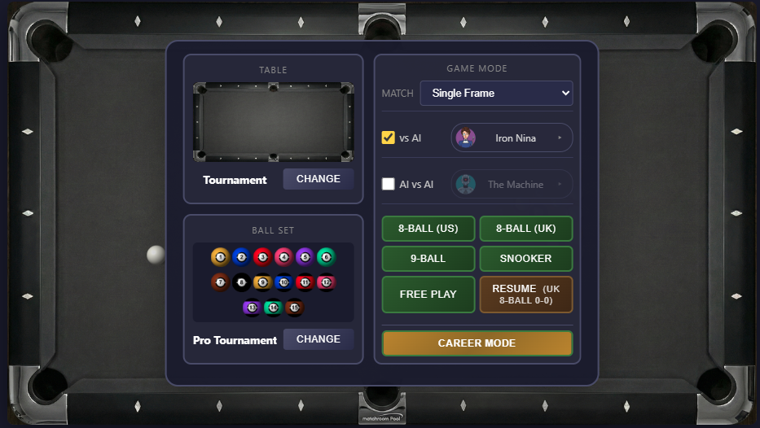

Welcome to **2D Pool & Snooker** — a physics-driven cue sports simulation that runs entirely in your browser. Powered by a professional-grade physics engine (Planck.js, a Box2D port), this isn't your typical "drag and flick" mobile pool game. This is the real deal: proper spin mechanics, realistic cushion physics, full rule implementations, and AI opponents that will genuinely make you sweat.

Whether you're a casual player looking for a quick frame of 8-ball over lunch, or a serious competitor grinding through career leagues in pursuit of every last achievement, there's a table waiting for you.

**What's on offer:**

- **5 game modes** — US 8-Ball, UK 8-Ball, 9-Ball, Snooker, and Free Play
- **8 unique AI opponents** — from the lovable Rookie Rick to the terrifying perfection of The Machine
- **Full Career Mode** — four leagues, two divisions, round-robin seasons, promotion, ELO ratings, and 42 achievements
- **Deep customisation** — 10+ tables, custom table creator, pre-made and fully custom ball sets with a powerful ball designer
- **Authentic rules** — including push-outs, free balls, miss rule, two-shot rule, and foul decisions
- **Realistic physics** — topspin, backspin, sidespin, swerve, cushion compression, and proper ball-to-ball elasticity

Let's break.

---

## Game Modes

### US 8-Ball

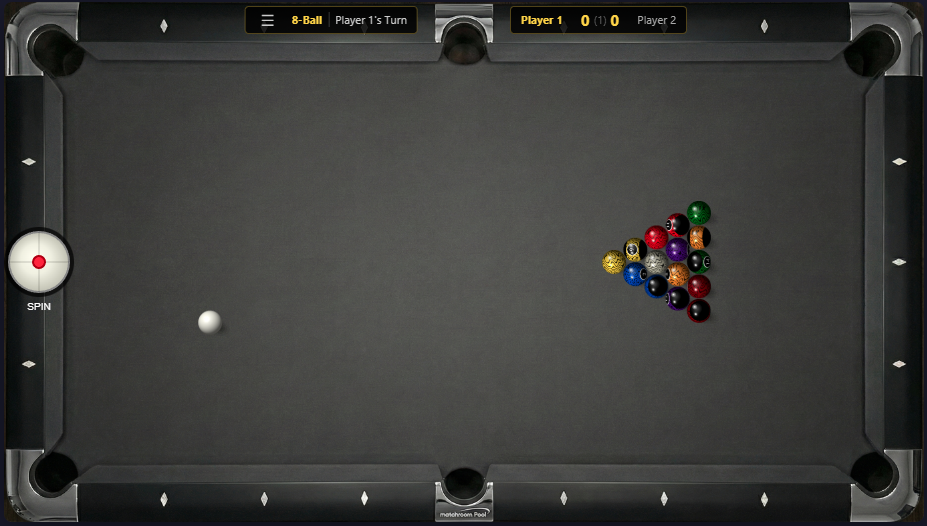

The classic American game. Fifteen balls racked in a triangle — solids (1-7), stripes (9-15), and the all-important 8-ball in the centre.

**How it works:**
- Groups (solids or stripes) are assigned by the first ball legally potted after the break — not during the break itself
- Clear all seven of your group, then pocket the 8-ball to win
- Pocket the 8-ball early, on a foul, or scratch while shooting it? That's an instant loss

**Break rules:** At least 3 object balls must cross the centre line or be pocketed. Fail to do so and it's a foul. If the 8-ball drops on the break, it's re-spotted — no harm done.

**Fouls award ball-in-hand** — your opponent can place the cue ball anywhere on the table. Yes, anywhere. Try not to foul.

---

### UK 8-Ball

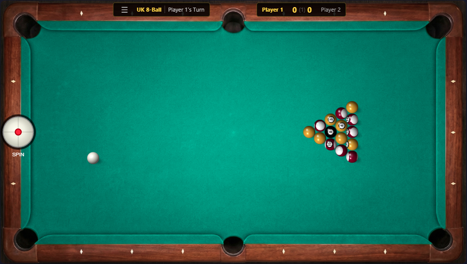

The pub rules. If you've ever played pool in a British pub, you know these rules — or at least you think you do. (Everyone's pub had slightly different rules. These are the proper ones.)

**Key differences from US 8-Ball:**
- **Two-shot rule** — Fouls give your opponent TWO visits. The first shot is a "free shot" where you can't lose the turn, even if you don't pot
- **Ball-in-hand only on a scratch** — Non-scratch fouls leave the cue ball where it lies
- **Ball-in-hand is behind the baulk line** — No placing it anywhere you like
- **You cannot clear your last ball and the black in the same shot** — Group must be fully cleared before you go for the black

Choose between **Red & Yellow** or **Blue & Yellow** colour schemes for that authentic pub feel.

---

### 9-Ball

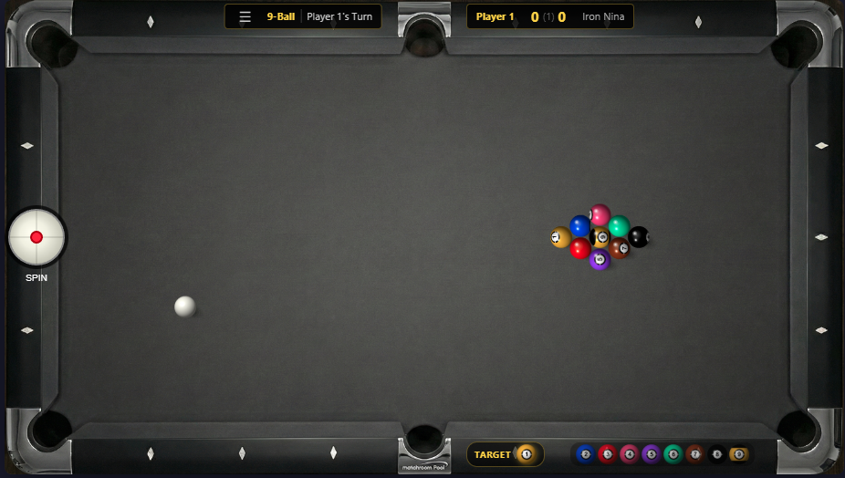

Fast, aggressive, and full of drama. Nine balls, diamond rack, and one simple rule: always hit the lowest-numbered ball first. Any ball can be pocketed on any shot — including the 9-ball for an early win.

**Push-Out Rule:** After the break, the incoming player can declare a "push out" — a free shot where normal rules are suspended. After a push-out, the opponent decides whether to play from the new position or hand the shot back. It's a chess move disguised as a pool shot.

**Three-Foul Rule:** Commit three consecutive fouls and you forfeit the frame. The game keeps count, so you'd better keep it clean.

**The 9-ball on a foul:** If potted illegally, it's re-spotted on the foot spot. The dream isn't over — it's just postponed.

---

### Snooker

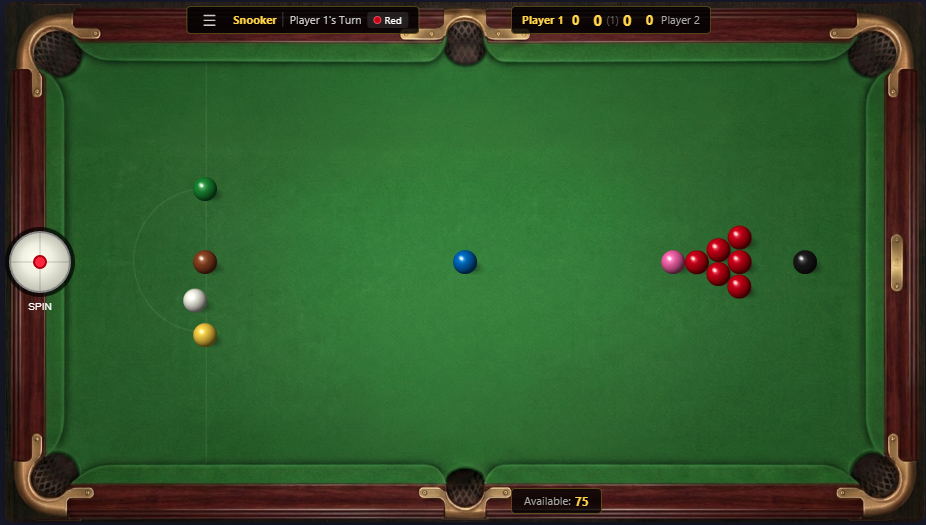

*This is where things get serious.*

Full WPBSA-style snooker rules, implemented with the kind of detail that would make a tournament referee nod approvingly. Two table formats are available:

**Mini Snooker** (tables 1-8): 6 reds and 6 colours on a standard-sized table. Perfect for quicker frames while still demanding real snooker thinking.

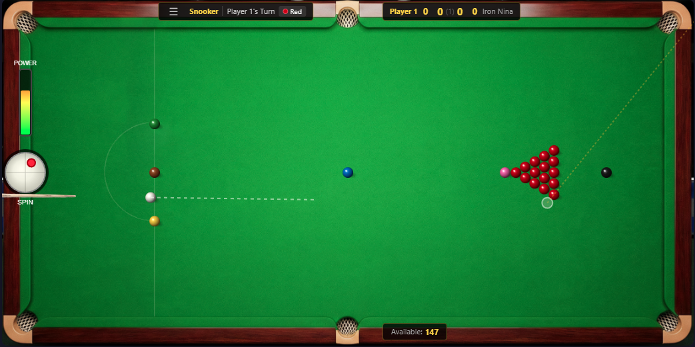

**Full-Size Snooker** (table 9): 15 reds and 6 colours on a larger table with smaller balls and tighter pockets. This is the real thing. If you can make a century break here, you've earned it.

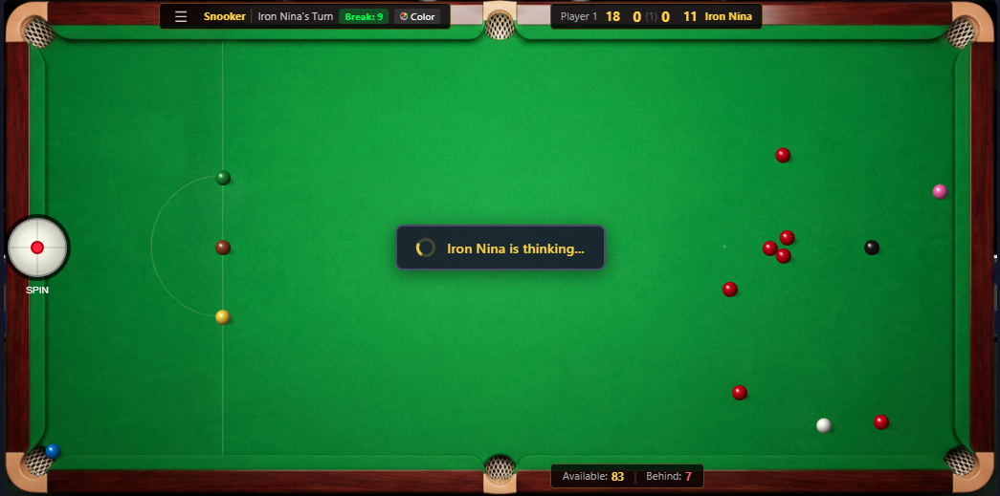

**The scoring system:**
- Reds are worth 1 point each. Colours: Yellow (2), Green (3), Brown (4), Blue (5), Pink (6), Black (7)
- Alternate between potting a red and a colour. Colours are re-spotted until all reds are gone
- Once the reds are cleared, pot the colours in ascending order (Yellow through Black) — they stay down this time

**The foul system** is comprehensive:
- Minimum 4-point penalty, or the value of the ball involved — whichever is higher
- Foul points are awarded to your *opponent*

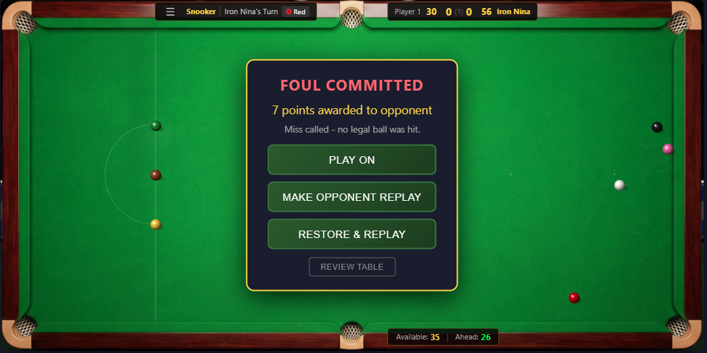

**After a foul, the incoming player gets options:**
- **Play On** — Accept the position and play
- **Make Opponent Replay** — Force the fouler to take the shot again
- **Restore & Replay** — Reset the table to exactly how it was before the foul (available on a "miss")
- **Free Ball** — If you've been left snookered by the foul, nominate any ball as the "ball on"

**The Miss Rule:** If a player fails to hit the ball-on and wasn't snookered, it's called a "miss." Three consecutive misses and the frame is forfeit. The game tracks this automatically — no arguments with the referee required.

---

### Free Play

A practice mode with no rules, no opponent, and no judgement. Just you, the balls, and a rerack button for when things go sideways. Perfect for practising spin, working on your long pots, or just enjoying the satisfying *clack* of balls colliding.

---

## How to Play

### Mouse Controls

**Aiming:** Click and drag anywhere on the table. The direction from the cue ball determines where you'll shoot — drag further away for more power.

**Shooting:** Release the mouse to fire. The cue pulls back as you increase power, giving you a clear visual of how hard you're about to hit.

**Cancel a shot:** Right-click to abort and re-aim.

**Spin (English):** The spin indicator sits on the left side of the screen — a small circle representing the face of the cue ball. Click and drag within it to set your contact point:
- **Up** = topspin (follow) — the cue ball runs through after contact
- **Down** = backspin (draw/screw) — the cue ball pulls back
- **Left/Right** = sidespin — the cue ball curves and throws off the cushion at altered angles

Spin is a game-changer. A well-placed bit of screw-back or a touch of right-hand side can be the difference between a simple pot and a frame-winning positional masterpiece.

### Touch Controls

**Aim:** Touch and drag anywhere on the canvas. The cue ball fires in the opposite direction of your drag.

**Power:** Use the vertical power meter above the spin indicator — drag up for more power, down for less.

**Spin:** Touch and drag the spin indicator with a second finger while holding your aim.

**Shoot:** Tap the shoot button below the spin indicator, or simply release your aiming finger.

**Ball-in-hand:** Touch and drag to position the cue ball. It turns red if you're placing it somewhere illegal.

### Aiming Aids

The game provides helpful visual guides while you aim:
- A **dashed white line** shows your aim direction
- A **ghost ball** appears where the cue ball will make contact with the target
- A **dashed yellow line** shows the predicted path of the target ball after contact

These guides are generous enough to help you plan, but they won't do the work for you. You still need to judge the angle, manage the power, and account for spin. This is a sim, after all.

---

## The AI Opponents

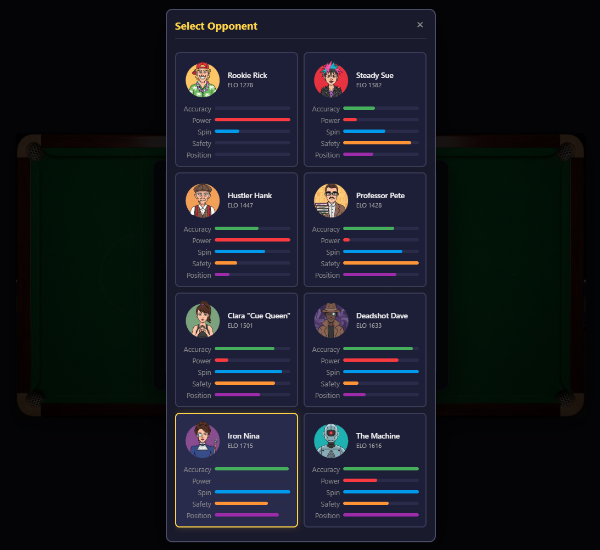

Eight distinct AI personalities, each with their own playing style, strengths, weaknesses, and ELO rating. They're not just difficulty sliders — they play genuinely different games.

### The Roster

| Avatar | Name | ELO | Style |
|:---:|---|:---:|---|
|  | **Rookie Rick** | ~1278 | Enthusiastic but erratic. Hits hard, aims... roughly. Picks shots at random. Everyone starts somewhere. |
|  | **Steady Sue** | ~1382 | Cautious and consistent. Won't beat you with flair, but won't give you many freebies either. Favours safety play. |
| 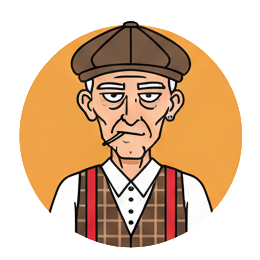 | **Hustler Hank** | ~1447 | Aggressive and confident. Goes for the pot more often than he should — but lands it more often than you'd like. |
|  | **Professor Pete** | ~1428 | The thinking player's opponent. Outstanding safety play and positioning, even if the pots aren't always flashy. |
|  | **Clara "Cue Queen"** | ~1501 | The complete package. Good accuracy, excellent spin control, smart shot selection. A proper challenge. |
|  | **Deadshot Dave** | ~1633 | The name says it all. Pinpoint accuracy with an aggressive temperament. He'll go for pots that shouldn't be possible — and make them. |
|  | **Iron Nina** | ~1715 | Near-perfect in every department. Exceptional positional play, devastating break-building, and the snooker escape artist you never wanted to face. |
|  | **The Machine** | ~1616 | Zero error. Perfect aim. Perfect power. Perfect positioning. It doesn't think — it calculates. Good luck. |

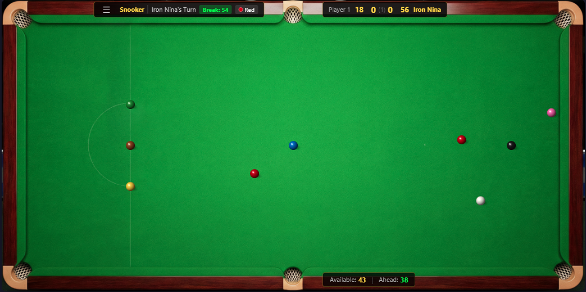

Each AI has five visible skill attributes:
- **Accuracy** — How precisely they aim (The Machine literally never misses the line)
- **Power** — How well they control shot power
- **Spin** — How effectively they use sidespin, screw, and follow
- **Safety** — Their tendency and ability to play defensive shots
- **Position** — How well they plan cue ball position for the next shot

**AI vs AI Mode:** Want to watch two AI players battle it out? Toggle "AI vs AI" in the menu and select personas for both sides. It's surprisingly entertaining — and educational — to watch Iron Nina dismantle Rookie Rick.

---

## Career Mode

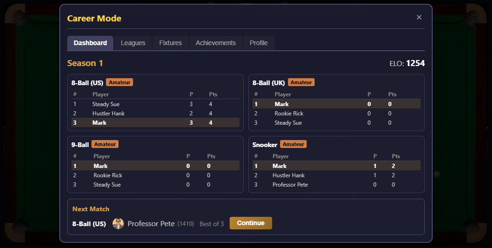

This is the heart of the single-player experience. Career Mode drops you into a competitive league system across all four game formats, with real progression, dynamic AI opponents, and 42 achievements to chase.

### How It Works

- **4 Leagues:** US 8-Ball, UK 8-Ball, 9-Ball, and Snooker
- **2 Divisions per league:** Amateur and Pro
- **5 players per division:** You and 4 AI opponents
- **Round-robin format:** Play every opponent once per season (4 matches per league, 16 total per season)
- **Match format:** Best of 3 in Amateur, Best of 5 in Pro

### The League Table

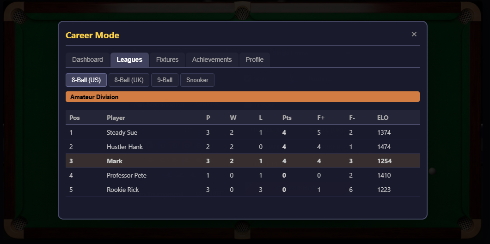

Standings are determined by:
1. **Points** (2 for a win, 0 for a loss)
2. **Frame difference** (frames won minus frames lost)
3. **Frames won** (total)

### Fixtures

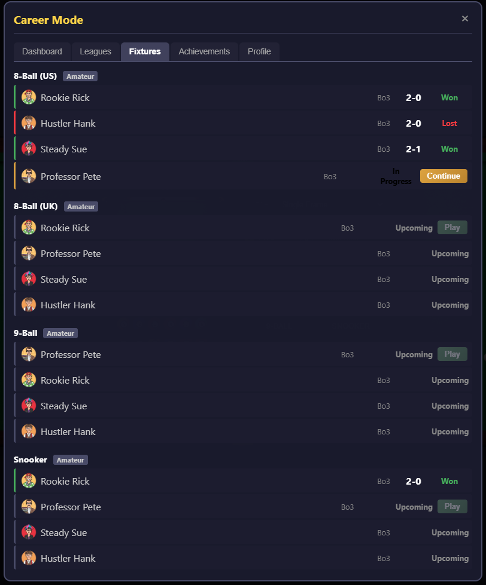

The Fixtures tab shows every match across all four leagues — upcoming, in progress, and completed. You can save and resume career matches at any time (one match at a time), so you're never forced to finish a best-of-5 snooker epic in one sitting.

AI opponents also play their own fixtures. After each match you complete, an AI vs AI fixture is simulated in the background using ELO-weighted probability. The league is alive whether you're watching or not.

### ELO Rating System

Your career ELO starts at **1254** and changes after every match. The system uses the standard ELO formula with K=32:

- Beat a higher-rated opponent? Big ELO gain.
- Lose to a lower-rated opponent? Significant ELO drop.
- The AI players' ELOs are dynamic too — they change based on their simulated results against each other.

### Promotion

Win your Amateur division and you're **promoted to Pro**. The Pro division features the four strongest AI opponents and Best of 5 matches. There's no relegation — once you've earned your place, you keep it.

### Profile

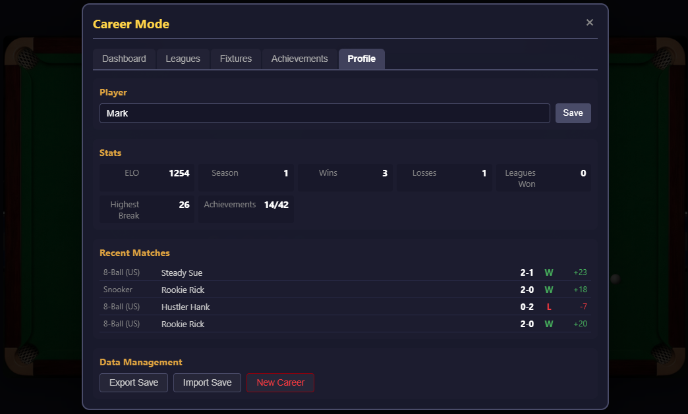

Your Profile tab tracks everything:
- Current ELO and season number
- Total wins, losses, and leagues won
- Highest snooker break
- Achievement count
- Your last 10 matches with scores and ELO changes

**Save Management:** Export your entire career as a JSON file for backup, or import a previous save. Never lose your progress.

---

## Tables & Customisation

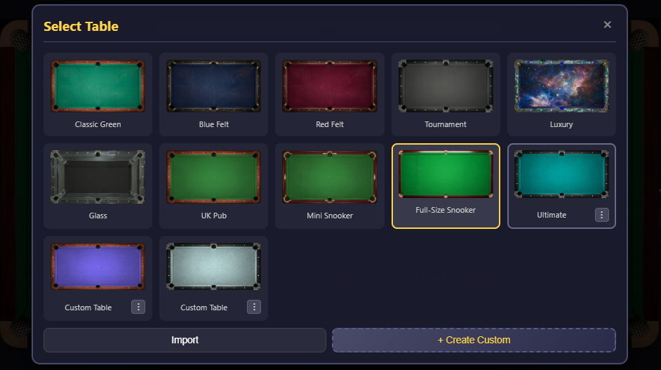

### Built-in Tables

Ten beautifully rendered tables, each with its own character:

| Table | Description |
|---|---|
| **Classic Green** | The standard. Traditional green baize, wooden rails. Home. |
| **Blue Felt** | Tournament-style blue cloth. Crisp and modern. |
| **Red Felt** | Bold red baize for when you're feeling dramatic. |
| **Tournament** | Professional dark cloth with clean lines. |
| **Luxury** | Rich tones and premium feel. For the discerning player. |
| **Glass** | Transparent playing surface. Because why not? |
| **UK Pub** | Smaller table, traditional pub style. Feels like a Friday night. |
| **Mini Snooker** | Green baize with snooker-style cushions and markings. 6 reds. |
| **Full-Size Snooker** | The big table. 15 reds, smaller balls, tighter pockets. Respect the table. |
| **Ultimate** | A sleek, modern design for serious sessions. |

### Custom Tables

Want something different? The **Create Custom** button lets you:
1. Choose a base table as your starting point
2. Adjust **Hue**, **Saturation**, and **Brightness** with sliders
3. Name your creation and save it

Custom tables can be **exported and imported** as JSON files — share your designs or back them up.

---

## Ball Sets & The Ball Creator

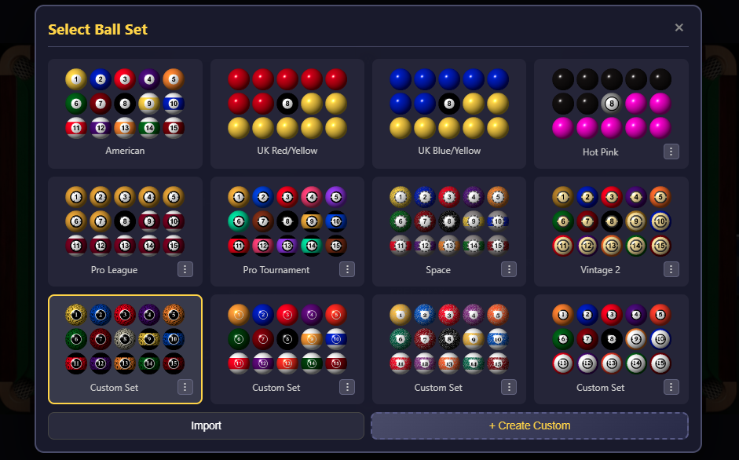

### Pre-made Ball Sets

Four standard sets cover the essentials:
- **American** — Classic numbered solids and stripes
- **UK Red/Yellow** — Solid-coloured, unnumbered, authentic British pub balls
- **UK Blue/Yellow** — Alternative UK colour scheme
- **Snooker** — Proper snooker ball colours

Five additional built-in custom sets showcase what the ball creator can do:
- **Hot Pink** — Bold solid-colour set
- **Pro League** — Striped with radial lines
- **Pro Tournament** — Individual ball colours for a premium look
- **Space** — Cosmic stripes with radial detailing
- **Vintage** — Vertical stripes in warm sepia tones

### The Ball Creator

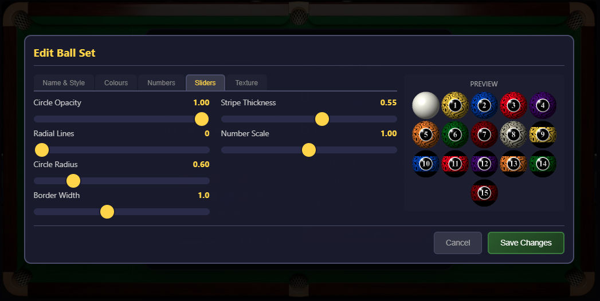

This is where things get creative. The Ball Creator is a full design studio with five tabs:

**Name & Style** — Name your set and choose between Solid or Spots & Stripes style. Toggle options like striped 8-ball and stripe orientation (horizontal or vertical).

**Colours** — Set colours for each ball group, or enable **Individual Ball Colours** mode for per-ball colour control. Customise the number circle colour, text colour, and border colour independently.

**Numbers** — Toggle number borders, choose border colours, and add decorative radial lines inside the number circle (0-20 lines).

**Sliders** — Fine-tune stripe thickness, number circle radius, border width, number text scale, and circle opacity. Small adjustments here make a big visual difference.

**Texture** — Apply procedural textures: camouflage, striped, marbled, or sparkly. Choose between auto-colour (matches the ball) or a single custom texture colour. Randomise the texture seed for endless variations.

The live **preview panel** on the right updates instantly as you tweak settings, showing all 16 balls. Ball sets can be exported and imported as JSON.

---

## Match Statistics

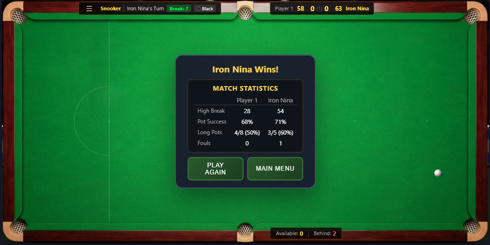

At the end of every match, the game presents a detailed statistical breakdown for both players:

| Stat | What It Tracks |
|---|---|
| **Pots** | Successful potting shots |
| **Total Shots** | Every shot taken |
| **Pot %** | Potting accuracy (pots / total shots) |
| **Long Pots** | Successful pots where the cue ball was more than 35% of the table width from the target |
| **Fouls** | Total fouls committed |
| **High Break** | Best consecutive scoring run |
| **Bank Shots** | Balls potted via a cushion |
| **Combos** | Balls potted off another object ball (plants) |

In snooker, **total points** and **break** stats take on even greater significance. Watch your high break climb as your positional play improves.

---

## Achievements

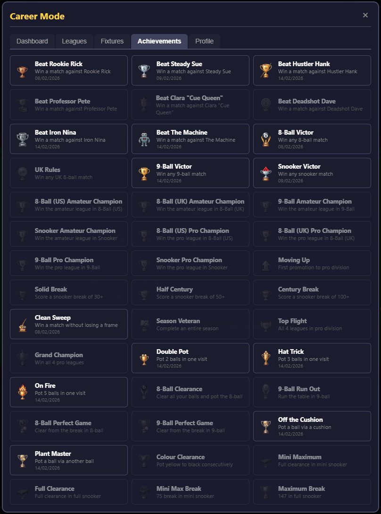

Career Mode features **42 achievements** to unlock. Each one comes with its own trophy — displayed in full colour when earned, greyed out when still waiting for you. Can you collect them all?

### Beat the Roster

Prove your worth against every opponent in the game. No hiding from the tough ones.

| Trophy | Achievement | How to Unlock |
|:---:|---|---|
|  | **Beat Rookie Rick** | Win a career match against Rookie Rick |
| 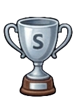 | **Beat Steady Sue** | Win a career match against Steady Sue |
|  | **Beat Hustler Hank** | Win a career match against Hustler Hank |
|  | **Beat Professor Pete** | Win a career match against Professor Pete |
|  | **Beat Clara "Cue Queen"** | Win a career match against Clara "Cue Queen" |
|  | **Beat Deadshot Dave** | Win a career match against Deadshot Dave |
| 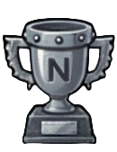 | **Beat Iron Nina** | Win a career match against Iron Nina |
|  | **Beat The Machine** | Win a career match against The Machine. Yes, it's possible. Probably. |

### Game Mode Victories

Show you can win in every format. Variety is the spice of cue sports.

| Trophy | Achievement | How to Unlock |
|:---:|---|---|
| 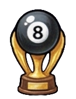 | **8-Ball Victor** | Win any 8-Ball (US) match |
|  | **UK Rules** | Win any 8-Ball (UK) match |
|  | **9-Ball Victor** | Win any 9-Ball match |
| 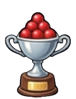 | **Snooker Victor** | Win any Snooker match |

### League Champions

Dominate the divisions. Eight trophies for eight league titles — four Amateur, four Pro.

| Trophy | Achievement | How to Unlock |
|:---:|---|---|
|  | **8-Ball (US) Amateur Champion** | Win the Amateur league in 8-Ball (US) |
|  | **8-Ball (UK) Amateur Champion** | Win the Amateur league in 8-Ball (UK) |
|  | **9-Ball Amateur Champion** | Win the Amateur league in 9-Ball |
|  | **Snooker Amateur Champion** | Win the Amateur league in Snooker |
|  | **8-Ball (US) Pro Champion** | Win the Pro league in 8-Ball (US) |
|  | **8-Ball (UK) Pro Champion** | Win the Pro league in 8-Ball (UK) |
|  | **9-Ball Pro Champion** | Win the Pro league in 9-Ball |
|  | **Snooker Pro Champion** | Win the Pro league in Snooker |

### Career Milestones

The long game. These track your overall career progression.

| Trophy | Achievement | How to Unlock |
|:---:|---|---|
|  | **Moving Up** | Earn your first promotion to the Pro division in any league |
| 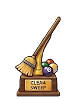 | **Clean Sweep** | Win a match without losing a single frame |
|  | **Season Veteran** | Complete an entire season (all fixtures across all 4 leagues) |
|  | **Top Flight** | Reach the Pro division in all 4 leagues |
|  | **Grand Champion** | Win all 4 Pro leagues. The ultimate career achievement. |

### Pool Pot Streaks

String together pots in a single visit. Easier said than done when the pressure is on.

| Trophy | Achievement | How to Unlock |
|:---:|---|---|
|  | **Double Pot** | Pot 2 balls in one visit |
|  | **Hat Trick** | Pot 3 balls in one visit |
|  | **On Fire** | Pot 5 balls in one visit. You're not missing, you're just... not missing. |

### Clearances & Perfect Games

The pinnacle of pool. Clear the table. Leave nothing behind.

| Trophy | Achievement | How to Unlock |
|:---:|---|---|
|  | **8-Ball Clearance** | Clear all your balls and pot the 8-ball in a single visit |
|  | **9-Ball Run Out** | Run the table in 9-Ball — pot all remaining balls in one visit |
| 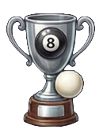 | **8-Ball Perfect Game** | Clear from the break in 8-Ball without your opponent taking a shot |
|  | **9-Ball Perfect Game** | Clear from the break in 9-Ball. The golden run. |

### Special Shots

Show some flair. These reward the creative shot-maker.

| Trophy | Achievement | How to Unlock |
|:---:|---|---|
|  | **Off the Cushion** | Pot a ball via a cushion (bank shot) |
|  | **Plant Master** | Pot a ball via another object ball (combo/plant) |

### Snooker Break Building

The gentleman's game demands precision and consistency. Build those breaks.

| Trophy | Achievement | How to Unlock |
|:---:|---|---|
|  | **Solid Break** | Score a snooker break of 30 or more |
|  | **Half Century** | Score a snooker break of 50 or more |
|  | **Century Break** | Score a snooker break of 100 or more. Welcome to the elite. |

### Snooker Clearances

The holy grails of snooker. Maximum breaks are the stuff of legends.

| Trophy | Achievement | How to Unlock |
|:---:|---|---|
|  | **Colour Clearance** | Pot Yellow through Black consecutively in the correct order |
| 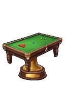 | **Mini Maximum** | Full clearance in Mini Snooker — pot every ball on the table |
| 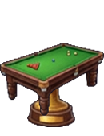 | **Full Clearance** | Full clearance in Full-Size Snooker. 15 reds, 15 blacks, and the colours. |
| 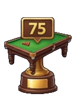 | **Mini Max Break** | Score a maximum 75 break in Mini Snooker |
|  | **Maximum Break** | Score a 147 in Full-Size Snooker. The holy grail. If you get this one, take a screenshot. |

---

## Settings & Tips

### In-Game Menu

During play, the hamburger menu gives you quick access to:
- **Pick Up Ball** — Re-enter ball-in-hand mode (when allowed)
- **Balls Upright** — Toggle ball faces to always face up (cosmetic)
- **Concede Frame** — Sometimes you know it's over
- **Quit Game** — Return to the main menu

### Sound

The audio system uses Web Audio synthesis for cushion hits, fouls, and victory jingles, combined with sampled sounds for ball collisions and pots. Snooker even distinguishes between soft and hard pots with different audio. Toggle sound on or off in settings.

### Game Speed

A speed slider lets you adjust from **0.2x** (slow-motion, great for studying ball paths) up to **2.0x** (for when you just want the AI to hurry up).

### Match Formats

Every game mode supports:
- **Single Frame** — Quick and decisive
- **Best of 3** — Short match, still demands consistency
- **Best of 5** — The standard competitive format
- **Best of 7** — Marathon sessions for the committed

Break alternates between frames, and frame scores are tracked throughout the match.

### Pro Tips

- **Learn spin early.** Even a small amount of topspin or backspin dramatically changes your positional play. The difference between a good player and a great one is where the cue ball ends up.
- **Watch the AI.** Especially the stronger opponents. Iron Nina's positional play is a masterclass. AI vs AI mode is genuinely useful for learning shot selection.
- **Respect snooker safety play.** In snooker, sometimes the best shot is the one that leaves your opponent in trouble. A good snooker is worth more than a risky pot.
- **Use Free Play.** No pressure, no opponent, just practice. Work on your long pots, your screw shots, your stun-runs. The rerack button is your friend.
- **Export your career saves.** Your progress is stored in the browser's local storage. Export regularly so a cleared cache doesn't erase your 147 and all 42 achievements.

---

## Technical Notes

- **No installation required** — runs in any modern browser
- **Mobile and touch optimised** — full touch controls with dedicated power meter and shoot button
- **Runs offline** — once loaded, no internet connection needed
- **Physics engine:** Planck.js (Box2D port) with 8 substeps per frame for collision accuracy
- **Ball rendering:** Real-time 3D sphere rendering with specular highlights and visible rolling

---

*Now chalk up, take a breath, and break.*

*The table is waiting.*
